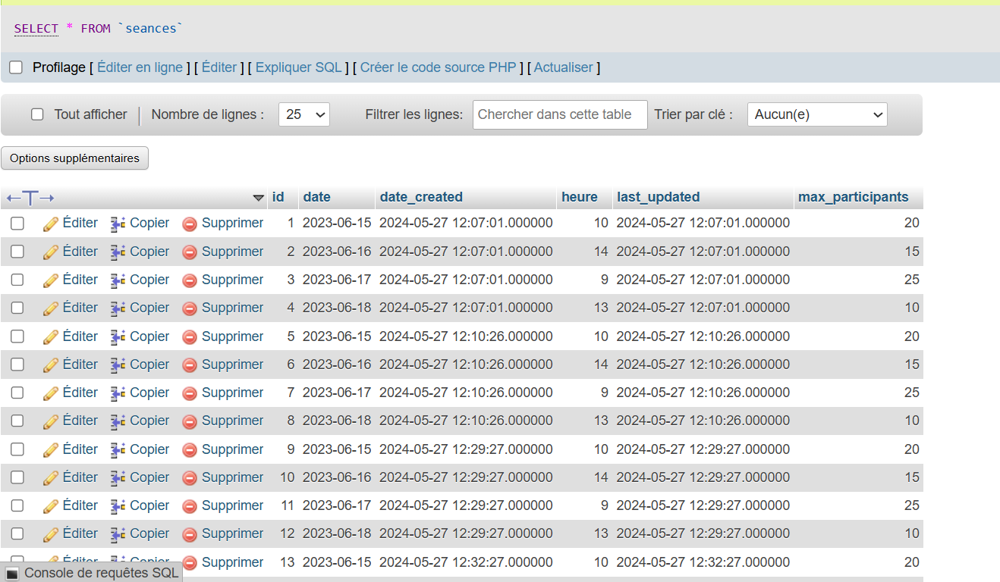

# MyAppReservationSystem

Vous êtes chargé de concevoir un système de réservation destiné à planifier
et gérer des séances orales. Ce système doit permettre aux utilisateurs de réserver
des créneaux horaires pour leurs oraux, plusieurs fois dans la même semaine, et
même deux fois dans une seule journée si un autre utilisateur annule sa réservation.
1. Règles de Gestion :
    Rôle de l&#39;administrateur :
    L&#39;administrateur planifie différentes séances orales chaque semaine.
    Il définit les membres du jury pour chaque séance.
    Les séances se déroulent entre 8h-12h et 14h-18h.
    Il fixe le nombre maximum de personnes pouvant réserver par heure.
    Règles de Réservation :
    Les utilisateurs peuvent réserver différentes séances à condition
   qu&#39;elles soient à des heures différentes.
    Pour optimiser les réservations, le système affiche un maximum de
   deux créneaux disponibles jusqu&#39;à ce qu&#39;ils soient complets, après quoi
   le créneau suivant est activé pour les réservations.

2. Consignes :
    Page Administrateur :

Doit permettre à l&#39;administrateur de réaliser toutes les opérations
nécessaires à la gestion des séances (planification, gestion des jurys,
etc.).

 Page de Réservation et Annulation :

Doit être très ergonomique, c&#39;est-à-dire facile à utiliser et intuitive pour
les utilisateurs.
 Page Admin-Contrôleur :

Permet à l&#39;administrateur de confirmer les rendez-vous pris par les
utilisateurs.

3. Fonctionnalités Supplémentaires :
   Rapports de Réalisation :
    Afficher les créneaux qui ont respecté un taux de présence supérieur à
   60%.
    Identifier les utilisateurs qui ont respecté au moins 70% de leurs
   réservations.
    Tout autre type de rapport est fortement recommandé.

Votre Mission :

1. Conception du Système :
    Définir les interfaces utilisateur (administrateur, réservation, annulation,
   contrôle).
    Concevoir la base de données pour gérer les séances, les réservations
   et les utilisateurs.

2. Implémentation des Fonctionnalités :
    Planification des séances par l&#39;administrateur.
    Système de réservation et d&#39;annulation pour les utilisateurs.
    Logiciel d&#39;optimisation des créneaux horaires.
    Génération de rapports de performance et de respect des réservations.
3. Expérience Utilisateur (UX) :
    Assurez-vous que la navigation et les actions de réservation/annulation
   soient simples et intuitives.
    Fournir des confirmations claires des réservations et annulations.
    Rendre l&#39;interface administrateur complète tout en restant facile à
   utiliser.
   Critères d&#39;Évaluation :
    Clarté et ergonomie des interfaces.
    Efficacité du système de réservation et annulation.
    Fonctionnalité du système d’optimisation des créneaux.
    Qualité et pertinence des rapports générés.
    Adéquation aux règles de gestion et consignes données.
    Enregistrer sous forme vidéo toutes les tâches ou les parties réalisé
   Votre travail doit démontrer une compréhension approfondie des besoins du
   système, ainsi que la capacité à créer une solution technique robuste et conviviale.

## Development

Update your local database connection in `application.properties` or create your own `application-local.properties` file to override
settings for development.

During development it is recommended to use the profile `local`. In IntelliJ `-Dspring.profiles.active=local` can be
added in the VM options of the Run Configuration after enabling this property in "Modify options".

In addition to the Spring Boot application, the development server must also be started - for this
[Node.js](https://nodejs.org/) version 20 is required. Angular CLI and required dependencies must be installed once:

```
npm install -g @angular/cli
npm install
```

The development server can be started as follows:

```
ng serve
```

Your application is now accessible under `localhost:4200`.

Add code using Angular schematics with `ng generate ...`.
Frontend unit tests can be executed with `ng test`.
Generate a messages.json for translation with `ng extract-i18n –format=json`.

## Build

The application can be built using the following command:

```
mvnw clean package
```

Start your application with the following command - here with the profile `production`:

```
java -Dspring.profiles.active=production -jar ./target/my-app-ReservationSystem-0.0.1-SNAPSHOT.jar
```

If required, a Docker image can be created with the Spring Boot plugin. Add `SPRING_PROFILES_ACTIVE=production` as
environment variable when running the container.

```
mvnw spring-boot:build-image -Dspring-boot.build-image.imageName=ma.enset/my-app-reservation-system
```

## Further readings

* [Maven docs](https://maven.apache.org/guides/index.html)  
* [Spring Boot reference](https://docs.spring.io/spring-boot/docs/current/reference/htmlsingle/)  
* [Spring Data JPA reference](https://docs.spring.io/spring-data/jpa/reference/jpa.html)
* [Learn Angular](https://angular.dev/tutorials/learn-angular)  
* [Angular CLI](https://angular.io/cli)  
* [Bootstrap docs](https://getbootstrap.com/docs/5.3/getting-started/introduction/)  

# Diagramme de Classe App Reservation System


# Base de Données App Reservation System


<h1>Table Jury </h1>

<h1>Table Seance </h1>

<h1>Table Jury-Seance </h1>

<h1>Table Utilisateurs </h1>

<h1>Table Reservations </h1>


# Backend App Reservation System

<h1>Swagger (Affichage Backend ) </h1>


<h2>utilisateurs-controller</h2>


<h4>Get All users</h4>


<h4>Get  user</h4>

<h2>Update User</h2>


<h2>Add User</h2>


<h2>seances-controller</h2>


<h2>reservations-controller</h2>


<h2>jurys-controller</h2>


# Frontend App Reservation System 
<h3>Login Page</h3>

<h3>Home Page</h3>

<h3>Get All users</h3>


<h3>Delete User</h3>


<h3>Edit User</h3>


<h3>Get All Reservation</h3>


<h3>Get All Jurys</h3>


<h3>Get All Seances</h3>


# By Fatima zahrae Zerheri & Racha Barbara
